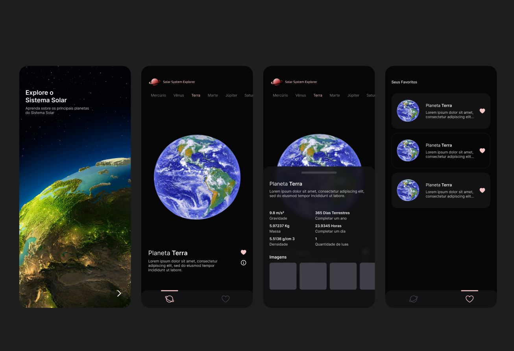

<h1 align="center">
    
    <br>
    Solar System Explorer. Explore os principais planetas do Sistema Solar (Em Desenvolvimento)
</h1>

<div align="center">
  
</div>

# Rodando o projeto

Você precisa ter o [Node](https://nodejs.org/en/), o [Git](https://git-scm.com/) e algum gerenciador de pacotes([NPM](https://docs.npmjs.com/downloading-and-installing-node-js-and-npm/) || [Yarn](https://classic.yarnpkg.com/lang/en/docs/install)) instalados em sua máquina.

Use o [ExpoGo](https://expo.dev/client) para rodar o app no seu dispositivo fisico ou no emulador.

```bash
1. Clone o repositório:
$ git clone https://github.com/gabriellima2/solar-system-explorer.git

2. Acesse a pasta e instale as dependências via terminal:
$ yarn || npm i

3. Inicie a aplicação em modo de desenvolvimento:
$ yarn start || npm run start

4. Escaneie o QRCode ou digite a URL informada
```

<p align="center">Projeto sendo feito com 💙 por <a href="https://www.linkedin.com/in/gabriel-lima-860612236">Gabriel Lima</a></p>
